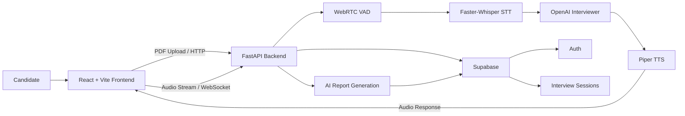

# LockedIn

AI-powered mock interviews with real-time voice interaction, resume-grounded questions, and actionable feedback.

LockedIn is a full-stack interview practice platform designed to simulate a realistic technical or behavioral interview.

Candidates can upload their resume, choose a role or domain, and have a spoken conversation with an AI interviewer. The application processes microphone audio in real time, converts speech to text, generates interviewer responses with OpenAI, speaks those responses using Piper TTS, stores interview sessions in Supabase, and produces a structured AI feedback report after the interview.

<p align="center">
  
  
  
  
  
</p>

## Overview

LockedIn focuses on making interview practice feel closer to an actual interview than a traditional question-and-answer form.

The interview flow is:

**Resume → Role Selection → Self Introduction → AI Interview → Feedback Report**

The AI interviewer uses the uploaded resume and selected domain to ask relevant questions, probe vague answers with follow-ups, and move through the interview naturally.

The application is voice-first: the candidate speaks through their microphone, while the interviewer responds with generated speech.

## Key Features

| Feature | Description |
|---|---|
| 📄 Resume-Grounded Interviews | Upload a PDF resume and receive questions based on the candidate's actual experience and skills. |
| 🎙️ Real-Time Voice Interview | Microphone audio is streamed to the backend over WebSocket. |
| 🧠 AI Interviewer | OpenAI generates technical, behavioral, and resume-specific questions and follow-ups. |
| 📝 Speech-to-Text | Faster-Whisper performs local English speech recognition. |
| 🔊 Text-to-Speech | Piper generates spoken interviewer responses locally using the included voice model. |
| ⏱️ Answer Timing | Answer durations are measured independently by the backend rather than estimated by the LLM. |
| 📊 AI Feedback Report | Generates an overall score, strengths, improvement areas, and question-level feedback. |
| 🗂️ Interview History | Previous sessions, transcripts, timings, resumes, and reports are persisted in Supabase. |
| 🔐 Authentication | Supabase Auth protects user sessions and backend endpoints. |
| 🛡️ Rate Limiting | Selected API endpoints are protected with SlowAPI. |
| 💻 Coding Interview Support | The interviewer can ask coding/technical questions and return code blocks for the transcript UI. |

## How It Works



### Interview audio pipeline

```
Microphone
    ↓
Web Audio API
    ↓
16-bit PCM audio
    ↓
WebSocket
    ↓
WebRTC VAD
    ↓
Faster-Whisper
    ↓
OpenAI interviewer
    ↓
Piper TTS
    ↓
WAV audio
    ↓
Browser playback
```

This separation keeps speech processing, LLM generation, audio synthesis, persistence, and UI responsibilities distinct.

## Tech Stack

**Frontend**
- React 19
- Vite
- React Router
- Supabase JavaScript Client
- Tailwind CSS
- shadcn-style / Radix UI components
- Lucide React
- Web Audio API
- WebSocket client

**Backend**
- Python
- FastAPI
- WebSockets
- NumPy
- WebRTC VAD
- Faster-Whisper
- OpenAI API
- Piper TTS
- pypdf
- Supabase Python Client
- PyJWT
- SlowAPI

**Data & Authentication**
- Supabase Auth — user authentication and session management
- Supabase Database — interview sessions, transcripts, timings, resumes, and reports

**Local Speech Models**
- Faster-Whisper `small.en` — speech-to-text
- Piper `en_US-lessac-medium` — text-to-speech

## Project Structure

```
lockedin/
│
├── backend/
│   ├── main.py
│   ├── auth.py
│   ├── db.py
│   ├── resume.py
│   ├── report.py
│   ├── llm_stream_test.py
│   ├── stt_test.py
│   ├── tts_test.py
│   ├── vad_stream.py
│   ├── audio_utils.py
│   ├── ffmpeg_bridge.py
│   ├── requirements.txt
│   ├── en_US-lessac-medium.onnx
│   └── en_US-lessac-medium.onnx.json
│
├── frontend/
│   ├── public/
│   ├── src/
│   │   ├── components/
│   │   ├── context/
│   │   ├── hooks/
│   │   └── lib/
│   ├── package.json
│   ├── package-lock.json
│   ├── vite.config.js
│   └── ...
│
├── .gitignore
└── README.md
```

### Important backend modules

| File | Responsibility |
|---|---|
| `main.py` | FastAPI routes, WebSocket interview loop, audio processing orchestration, timing, and rate limiting |
| `auth.py` | Supabase JWT verification and authenticated-user extraction |
| `db.py` | Supabase session persistence and user-scoped database operations |
| `resume.py` | In-memory PDF text extraction |
| `report.py` | Generates structured post-interview feedback using the transcript |
| `llm_stream_test.py` | OpenAI interviewer prompt, resume grounding, and streamed responses |
| `stt_test.py` | Faster-Whisper transcription |
| `tts_test.py` | Piper voice synthesis |
| `vad_stream.py` | WebRTC voice activity detection |
| `audio_utils.py` | Audio conversion utilities |
| `ffmpeg_bridge.py` | FFmpeg/audio-related utilities |

## Getting Started

### Prerequisites

Before running LockedIn locally, make sure you have:

- Python 3.10+
- Node.js and npm
- A Supabase project
- An OpenAI API key
- A browser with microphone support
- Sufficient CPU/RAM for local Faster-Whisper and Piper inference

### 1. Clone the Repository

```bash
git clone https://github.com/IshitwoKhanra/lockedin.git
cd lockedin
```

### 2. Configure the Backend

Move into the backend directory:

```bash
cd backend
```

Create a virtual environment:

```bash
python -m venv venv
```

**Windows PowerShell**

```powershell
.\venv\Scripts\Activate.ps1
```

**Windows Command Prompt**

```cmd
venv\Scripts\activate
```

Install the Python dependencies:

```bash
pip install -r requirements.txt
```

Create `backend/.env` using the following variables:

```env
OPENAI_API_KEY=your_openai_api_key
SUPABASE_URL=https://your-project.supabase.co
SUPABASE_SERVICE_ROLE_KEY=your_supabase_service_role_key
```

> **Do not commit `backend/.env`.** The Supabase service-role key and OpenAI API key are sensitive credentials and must remain server-side.

Start the backend:

```bash
uvicorn main:app --reload --env-file .env
```

The API will be available at:

```
http://localhost:8000
```

A basic health check is available at `GET /`. Expected response:

```json
{"status": "ok"}
```

### 3. Configure the Frontend

Open a second terminal and move into the frontend directory:

```bash
cd frontend
```

Install dependencies:

```bash
npm install
```

Create `frontend/.env` with:

```env
VITE_SUPABASE_URL=https://your-project.supabase.co
VITE_SUPABASE_ANON_KEY=your_supabase_anon_key
```

Start the development server:

```bash
npm run dev
```

The frontend will normally be available at:

```
http://localhost:5173
```

### 4. Supabase Setup

LockedIn uses Supabase for authentication and persistence.

**Authentication**

Supabase Auth is used to:
- Sign users in
- Maintain user sessions
- Provide access tokens
- Authenticate requests to protected backend endpoints

The backend validates Supabase-issued JWTs before accessing user-specific data.

**Database**

The backend expects a `sessions` table containing fields used by `backend/db.py`, including:

```
id
user_id
resume_text
transcript
timings
report
created_at
```

The JSON-like fields such as `transcript`, `timings`, and `report` should support JSON data, such as PostgreSQL `jsonb`.

> Review and configure Row Level Security policies appropriately before deploying the application publicly.

## Environment Variables

The repository intentionally excludes real environment files.

**Backend**

```env
OPENAI_API_KEY=
SUPABASE_URL=
SUPABASE_SERVICE_ROLE_KEY=
```

**Frontend**

```env
VITE_SUPABASE_URL=
VITE_SUPABASE_ANON_KEY=
```

The repository may contain `.env.example` files containing these variable names, but real values should only exist in local `.env` files or a secure deployment environment.

### Credential responsibilities

| Variable | Location | Purpose |
|---|---|---|
| `OPENAI_API_KEY` | Backend only | OpenAI API access |
| `SUPABASE_SERVICE_ROLE_KEY` | Backend only | Server-side Supabase access |
| `SUPABASE_URL` | Backend | Supabase project URL |
| `VITE_SUPABASE_URL` | Frontend | Supabase project URL |
| `VITE_SUPABASE_ANON_KEY` | Frontend | Browser-side Supabase authentication/client access |

> Never expose `SUPABASE_SERVICE_ROLE_KEY` or `OPENAI_API_KEY` to the frontend.

## Security

LockedIn is designed with several security boundaries:

**Authentication**
Backend endpoints that operate on user data use authenticated Supabase user IDs.

**User-scoped database access**
Database queries explicitly filter by the authenticated `user_id`, preventing one authenticated user from requesting another user's sessions through the backend.

**JWT verification**
The backend verifies Supabase-issued JWTs using Supabase's public signing keys rather than trusting user-provided IDs.

**Rate limiting**
Selected API endpoints use SlowAPI to reduce abuse and excessive requests.

**Secret management**
Sensitive values are stored in `.env` files and excluded from Git through `.gitignore`.

Before publishing the repository, verify:

```bash
git status
git diff --cached
```

and make sure no credentials appear in the staged changes.

> If a credential has ever been committed publicly, rotate/revoke it. Adding it to `.gitignore` does not remove a secret that already exists in Git history.

## Interview Flow

LockedIn follows a structured interview process.

**Phase 1 — Resume & Domain**
The interviewer reads the uploaded resume and identifies the candidate's name and key skills. The candidate then chooses the role or domain they want to practice.

**Phase 2 — Self Introduction**
The candidate gives a short interview-style introduction. The interviewer acknowledges the response without immediately grading it.

**Phase 3 — Interview Questions**
The interviewer asks a mixture of:
- Resume-specific technical questions
- Project deep-dives
- Technical decision and trade-off questions
- Behavioral questions
- Managerial questions
- Follow-up questions when an answer lacks sufficient detail

The interviewer asks one question at a time and waits for the candidate's response.

## Feedback Report

After the interview, LockedIn generates a structured report. The report includes:

- Overall score
- Overall summary
- Strengths
- Areas to improve
- Per-question analysis
  - Answer summary
  - Specific feedback
  - Question-level score
  - Ideal approach
  - Answer duration

The report is generated from the actual interview transcript. The backend also injects measured answer durations rather than asking the LLM to estimate timing.

> AI scores are intended for practice and coaching. They are not a certified assessment or prediction of real-world interview performance.

## Local Speech Processing

LockedIn performs key parts of the voice pipeline locally.

**Voice Activity Detection**
WebRTC VAD identifies when the candidate starts and stops speaking.

**Speech-to-Text**
Faster-Whisper processes the captured audio using `small.en`. Audio is processed as 16 kHz mono PCM and converted to the format expected by Whisper.

**Text-to-Speech**
Piper synthesizes the AI interviewer's response using `en_US-lessac-medium.onnx`. The generated audio is returned to the browser for playback.

> The Piper model file is included in the repository because it is required by the current backend implementation.

## Development Commands

**Frontend**

```bash
npm run dev       # Start development server
npm run build      # Build for production
npm run lint       # Run ESLint
npm run preview    # Preview a production build
```

**Backend**

```bash
uvicorn main:app --reload --env-file .env   # Start FastAPI with hot reload
```

## Current Development Configuration

The current frontend is configured for local development and communicates with:

```
HTTP:      http://localhost:8000
WebSocket: ws://localhost:8000/ws/audio
```

For production deployment, these URLs should be moved to configurable environment variables and the backend CORS configuration should be updated accordingly.

The application also requires browser microphone permission during an interview.

## Performance Considerations

Because speech recognition and text-to-speech are performed locally, the backend requires more CPU and memory than a typical CRUD application.

Performance depends on:
- CPU capabilities
- Available RAM
- Faster-Whisper model size
- Audio length
- OpenAI response latency
- Piper synthesis time

OpenAI API usage may also incur API costs.

## Repository Hygiene

The following files/directories should remain local and should not be committed:

```
.env
.env.*
venv/
.venv/
node_modules/
__pycache__/
*.zip
```

In particular, `backend/.env` and `frontend/.env` must never contain credentials in the GitHub repository.

## Roadmap

Potential future improvements include:

- Production deployment configuration
- Configurable frontend/backend API URLs
- HTTPS/WSS support
- Improved mobile responsiveness
- More interview modes and role presets
- Additional speech models and language support
- More detailed interview analytics
- Git LFS or external model storage for large ML assets
- Automated tests and CI/CD
- Production-grade observability and error reporting

## License

No open-source license has currently been selected for this project.

Until a license is added, the repository should not be assumed to grant permission to reuse, modify, or redistribute the code.

## Built With

React · Vite · FastAPI · OpenAI · Faster-Whisper · Piper · WebRTC VAD · Supabase

<p align="center">
  <strong>LockedIn — Practice smarter. Interview better.</strong>
</p>